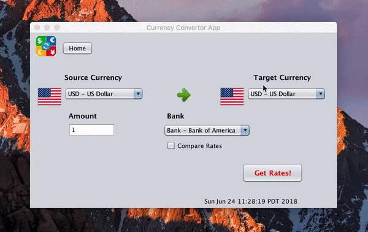

## Currency Convertor App
  
###About  

This convertor is an application to check the currency rates for different 
countries and is useful while visiting other countries. It is a type of 
calculator that converts the value of one of the currency into another
currency.

### Demo

### Features

1. Users can select from 6 currencies and 3 banks. 
2. Users can look for comparison rates for multiple banks and it suggests 
   the best rate of the bank.
3. Users are able to choose one option between choosing bank and comparison rates.
4. Users can see conversion rates, bank fees, transaction fees and
   net proceed and also current day, date and time.

### Getting Started

1. Fork and clone the repository.
2. Import the project in NetBeans/IDE.
3. Run the project in NetBeans/IDE

### Prerequisites

1. JDK 7 or above
2. git

### Built With

1. NetBeans
2. GUI

### Future Scope

1. Include real time data for currency rates.
2. Include all world currencies.